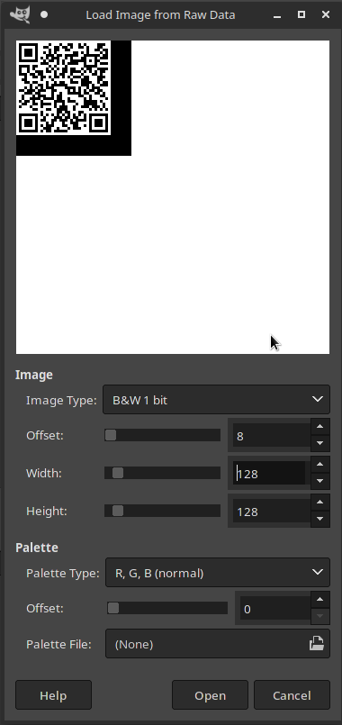

unknown_file
============

**Points:** 300 (282 after dynamic scoring)

**Flag:** RTN{b1tm4ps_d0nt_n33d_h34d3r_1nf0}

The key insight required here is that the data is pixel data, but with the header stripped out. This can be recognized by the fact that the hex data contains lots of repeating data. The message also hints towards "visualizing" the data somehow.

Using tools like GIMP it is possible to recover the original image by playing around with the width and height of the image, to reveal a QR code with the flag.

